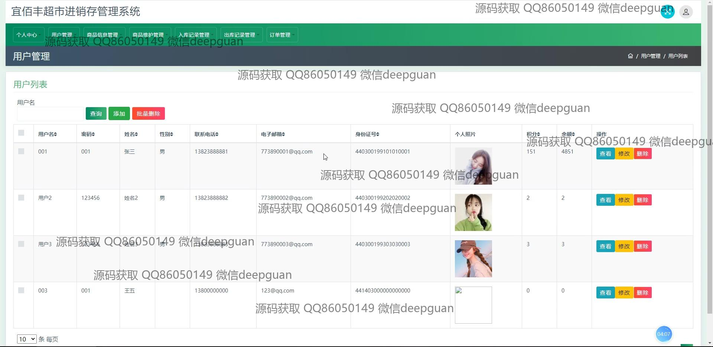
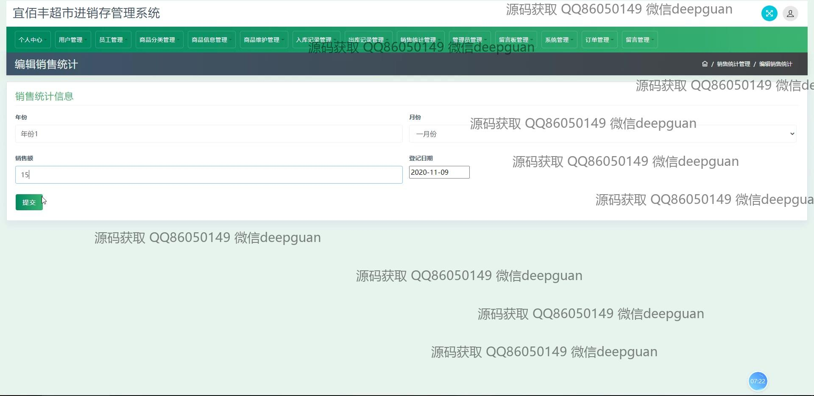

<h1 align="center">的宜百丰超市进销存购物商城</h1>

## 简介
宜百丰超市进销存管理系统：支持用户管理、商品信息管理、销售统计、订单管理、购物车功能；涵盖用户注册、新闻资讯发布、个人信息管理、后台管理等模块。    --计算机毕业设计源码；毕设源码；java毕业设计源码

## 联系方式

<h3 align="center">获取完整代码与数据库文件 + 微信：deepguan QQ: 86050149 QQ群: 783742310</h3>

<h3 align="center">可帮忙远程部署 包运行成功！提供远程部署、修改代码、设计文档指导、代码讲解等服务！</h3>

## 功能介绍（完整见运行截图）
管理员：登录、注册、退出、个人信息管理、用户管理、员工管理、商品分类管理、库存记录管理、销售统计、订单管理、轮播图信息管理。支持商品信息编辑、入库、出库操作，查看销售数据，管理用户积分和余额，维护系统轮播图与广告内容。

用户：登录、注册、退出，个人信息查看与修改，支持上传头像，管理我的订单、我的地址、我的收藏。用户可浏览新闻资讯、留言反馈，访问商品详情、添加购物车、进行订单结算与支付，同时查看积分和余额。

员工：登录、退出，管理商品库存，协助商品信息维护，包括编辑商品信息、调整价格、上传商品图片。支持查看销售统计，操作商品入库与出库流程，保证库存数据准确。

游客：无需登录即可浏览网站首页，查看商品列表、商品详情、新闻资讯、留言反馈等内容。支持通过主导航栏快速跳转模块，了解系统功能与促销活动。

## 运行截图

本代码来源于网络,仅供学习参考使用!

